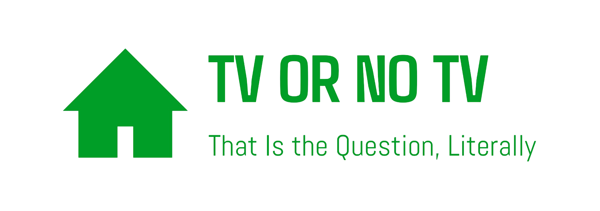

# 

This is a TV Shows application built using **React**, **TypeScript**, and **Tailwind CSS**, fetching data from the [TVMaze API](https://api.tvmaze.com/shows). The app displays a paginated list of TV shows, with features such as filters, sorting, TV show overview pages, and a favorites system. It also supports dark and light themes.

## Features

### Home Page

- **Paginated list of TV Shows**: Displays a list of TV shows with a poster, title, shortened description, rating, and genres.
- **Filters**:
  - **Genre** filter (multi-select)
  - **Status** filter (single-select)
- **Sorting**:
  - Sort TV shows by **name** or **premiere date** in both ascending and descending order.

### TV Show Overview Page

- Clicking on a TV show in the Home or Favorites page routes to the **show overview page**.
- The show overview page includes the full poster image, a complete description, and other most relevant data from the API.

### Favorites Page

- A **Favorites page** lists all favorited TV shows.
- No pagination is used.
- TV shows can be added or removed from favorites, utilizing **Local Storage** for persistent state.

### Responsive Design

- The app is **fully responsive** and optimized for mobile, tablet, and desktop screens.

### Bonus Features

- Written in **TypeScript** for better type safety.
- Supports both **dark** and **light themes**.
- Deployed and accessible online.

## Easter Eggs (Shh, Don’t Tell Anyone!)

**Remember those childhood games where you could unlock hidden surprises**? Think of that massive open-world game where typing in certain codes grants you fun and interesting surprises!

Just like in that game, **type a specific code** on your keyboard and discover a few _simple surprises_! It's like adding cheat codes to your daily life. Imagine if we could do this in real life too!

Let’s just say, it’s a bit of a _secret adventure_. Who knows what fun you’ll uncover!

And just for fun, **don’t peek at the “DontLookHere” component** - it’s all about the journey, not the shortcut!

## Installation

To run this project locally, follow these steps:

1. **Clone the repository**:

   ```bash
   git clone https://github.com/aldask/tv-or-no-tv.git
   ```

2. **Install dependencies**:

   ```bash
   npm install
   ```

3. **Run the app**:

   ```bash
   npm run dev
   ```

4. Open [http://localhost:5173](http://localhost:5173) in your browser to view the app.

## Technologies Used

- **React** for building the user interface.
- **TypeScript** for static typing.
- **Vite** for fast development and bundling.
- **Tailwind CSS** for utility-first CSS styling.
- **Local Storage** for managing favorites.
- **React Router** for navigation.

## Live View

The app has been deployed and can be accessed at the following URL:

[TV or No TV](https://tv-or-no-tv.vercel.app/)
